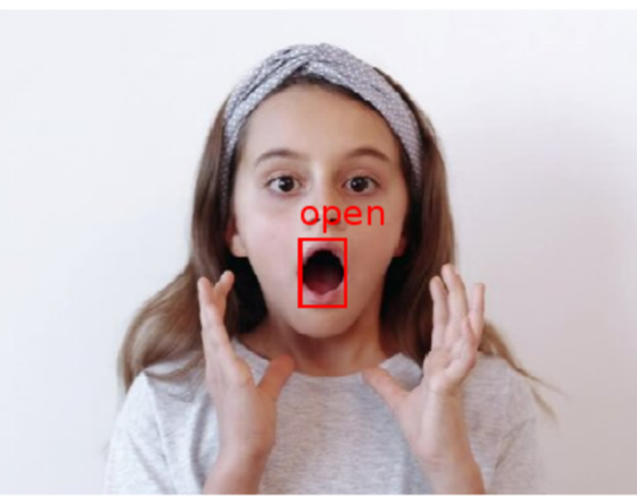

# mouth-detection-using-color-model
Here's a simple mouth detection code using DIP color model.

## why create this repo
Many image-related tasks now use deep learning methods, and it is rare to see faces detected by **classical digital image processing** methods. 

The code in this repo simply refers to some work to extract the mouth of the face and determine whether it is open.
## results

## reference (GB-T)
[1] bin Abdul Rahman N A, Wei K C, See J. Rgb-h-cbcr skin colour model for human face detection[J]. Faculty of Information Technology, Multimedia University, 2007, 4.

[2] Hsu R L, Abdel-Mottaleb M, Jain A K. Face detection in color images[J]. IEEE transactions on pattern analysis and machine intelligence, 2002, 24(5): 696-706.
